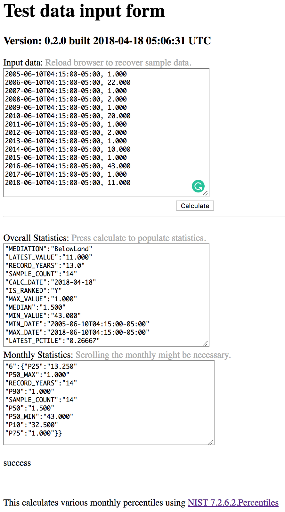

NGWMN Statistics Microservice
================================

A web service that returns a JSON formated statistics analysis of input data.

## Install

This project uses maven build.

```sh
# spring-boot build
$ maven package
```

## Usage

This is only a documentation package. You can print out [spec.md](spec.md) to your console:

```sh
# for INFO level debug spring-boot launch
$ ./boot

# for DEBUG level (and other dev env settings) launch
$ ./boot dev

# shutdown procedure is simply
./shutdown

# if the app.pid does not exist or is wrong
./stop
# kills all spring-boot
```


* http://localhost:8765/
* http://localhost:8765/statistics/
	both return up status of service
* http://localhost:8765/statistics/version
	returns the build version page
* http://localhost:8765/statistics/input
	returns a data test input page
* http://localhost:8765/statistics/calculate
	the restful service end to post data and returns the statistics calculations JSON response


## Screenshots




