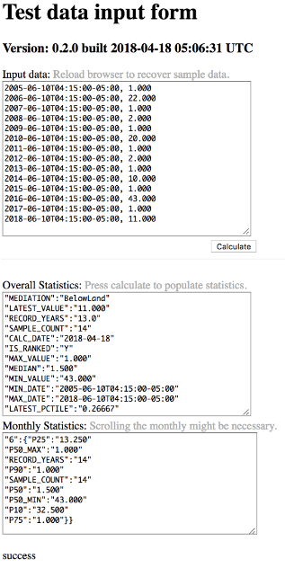

# Statistics
A time series statistics micro service. It accepts time series data and returns overall and monthly statistics for months that qualify.

Overall statistics returned include:
```Highest Water Level	
Median Water Level	
Lowest Water Level	
First Measurement Date	
Last Measurement Date	
Years of Record
Number of Measurements	
```
Monthly statistics are returned only of they qualify. Each month must have ten unique years of data and latest sample must be within 406 days from submission date. The returns statistics include:
```10th Percentile	
25th Percentile	
50th Percentile	
75th Percentile	
90th Percentile	
Lowest Median	
Highest Median	
Years of Record
Number of Measurements for the month
```
Sample JSON respones
```
{
  "overall": {
    "MEDIATION":"BelowLand",
    "MAX_VALUE":"1.000",
    "MEDIAN":"1.500",
    "MIN_VALUE":"43.000",
    "MIN_DATE":"2005-06-10T04:15:00-05:00",
    "MAX_DATE":"2018-06-10T04:15:00-05:00",
    "RECORD_YEARS":"13.0",
    "LATEST_VALUE":"11.000",
    "SAMPLE_COUNT":"28",
    "LATEST_PCTILE":"0.31250"
    "CALC_DATE":"2018-08-09",
    "IS_RANKED":"Y",
  },
  "monthly": {
    "6": {
    "P10":"32.500",
    "P25":"13.250",
    "P50":"1.500",
    "P75":"1.000"
    "P90":"1.000",
    "P50_MIN":"43.000",
    "P50_MAX":"1.000",
    "RECORD_YEARS":"14",
    "SAMPLE_COUNT":"15",
    }, "7": {
    "P10":"34.600",
    "P25":"15.000",
    "P50":"1.000",
    "P75":"1.000"
    "P90":"1.000",
    "P50_MIN":"43.000",
    "P50_MAX":"1.000",
    "RECORD_YEARS":"13",
    "SAMPLE_COUNT":"13",
    }
  },
}
```

Statistics Microservice
================================

A web service that returns a JSON formated statistics analysis of input data.

## Install

This project uses maven build.

```sh
# spring-boot build
$ maven package
```

## Usage

This is only a documentation package. You can print out [spec.md](spec.md) to your console:

```sh
# for INFO level debug spring-boot launch
$ ./boot

# for DEBUG level (and other dev env settings) launch
$ ./boot dev

# shutdown procedure is simply
./shutdown

# if the app.pid does not exist or is wrong
./stop
# kills all spring-boot
```


* http://localhost:8777/
* http://localhost:8777/statistics/
	both return up status of service
* http://localhost:8777/statistics/version
	returns the build version page
* http://localhost:8777/statistics/input
	returns a data test input page
* http://localhost:8777/statistics/calculate
	the restful service end to post data and returns the statistics calculations JSON response
* http://localhost:8777/statistics/calculate/medians
	Like the caclculates service but also return intermediate median values as well.


## Screenshots




## setting up Jenkins

### build
* Use pipelines
	create a pipeline build pointing to this repo and the Jenkinsfile
* Make it a parameterized build
    DRY_RUN - boolean to test builds without deploying artifacts
    	A dry run can be performed for either snapshots or releases
    RELEASE_BUILD - boolean to initiate a maven release

### deploy
* Use cargo generic webapp deployer
	point to the cargo project
* Make it a parameterized build
	TOMCAT_SERVER - list and enter cargo IDs configured in settings.xml
		this is the server target to deploy to
	REPO_NAME	  - the name of the Artifcatory repo. Example: wmn-maven-centralized
		this is used buy the cargo pom to find the repo while the next is for version numbers
	CARGO_DEPLOY  - "list maven artifact versions" to select the artifact version to deploy
		this is named to be version number used in the cargo pom
		Repository Base URL - Artifactory URL including the repo name
		Group Id    - set to "gov.usgs.water"
		Artifact Id - set to "statistics"
		Packaging   - set to "war"
	

